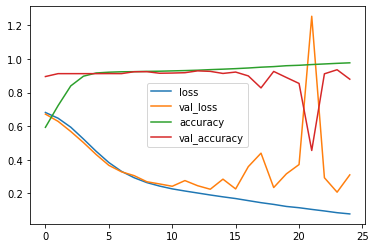
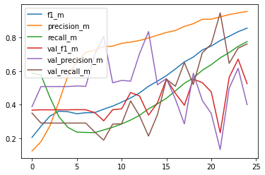
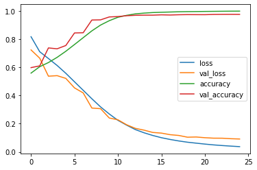
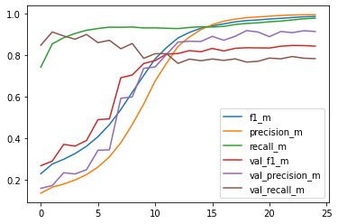
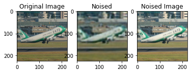
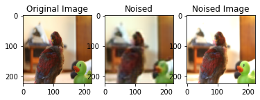

# Multi - Label Classification on PASCAL VOC (2009)

The .ipynb notebook can be run directly on Google Colab. The dataset is donloaded automatically and saved to the local colab session. 

The classifier is trained using VGG16 architecture as backbone for both from the scratch and transfer leaerning methods.

## Training the model from scratch
The model results are given below. The model gives an training accuracy of 81% which is rather high compared to other evaluation metrices like f1 score and precision. The dataset is imbalanced due to large number of data samples for class **Person** compared to other classes.

The training curves are as below

 

**Test set loss          : 17.46%  
Test set accuracy      : 94.82%  
Test set f1_m          : 73.11%  
Test set precision_m   : 67.95%  **

Some of the model predictions on test set is

## Training the model using Transfer Learning
The model results are given below. The performance of the model get better with Transfer Learning.

The training curves are as below

 

**Test set loss        : 8.67%  
Test set accuracy      : 97.62%  
Test set F1 score      : 85.37%  
Test set precision     : 92.13%  **

Some of the model predictions on test set is

# Adversarial Attack

A encoder-decoder model is trained to generate a noisy image for train and test sets. This is done selectively on two classes of images (**aeroplane and bird**). The classifier is fooled with this noisy images
for its performance. Two sets of adversariaries are trained for train and test sets. 

The adversarial images are as shown below

 

The adversarial attack results on the classifier are as given below

##Train set Adversary

Results on Actual images:

**Actual Train set accuracy   : 97.42%   
Actual Train set F1 score     : 81.23%  
Actual Train set precision    : 72.32%  **

Results on Noised images:

**Noised Train set accuracy   : 97.11%  
Noised Train set F1 score     : 79.02%   
Noised Train set precision    : 70.11%  **

##Test set Adversary

Results on Actual images:

**Actual Test set accuracy    : 92.47%  
Actual Test set F1 score      : 52.17%  
Actual Test set precision     : 44.40%  **

Results on Noised images:

**Noised Test set accuracy    : 92.47%  
Noised Test set F1 score      : 50.51%   
Noised Test set precision     : 43.60%   **

