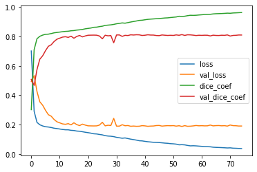
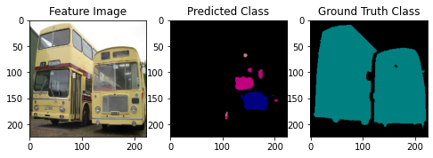
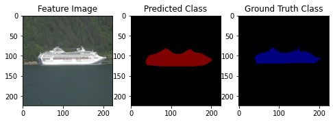
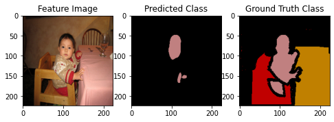
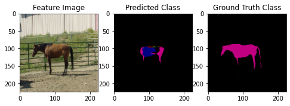
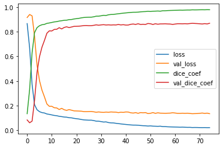
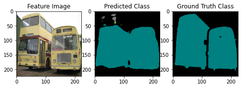
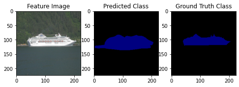
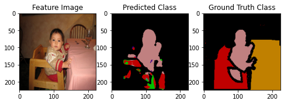
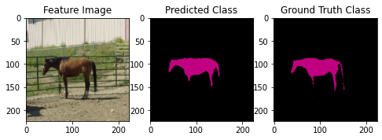

# Semantic Segmentation on PASCAL VOC (2009)

The .ipynb notebook can be run directly on Google Colab. The dataset is downloaded automatically and saved to the local colab session. 

The segmentation model is trained using VGG-UNet architecture as backbone for both from the scratch and transfer leaerning methods.

## Training the model from scratch

The segmentation model is trained by building it with dice loss and dice co-efficients as metrics. The model performance is not great as it gives only a mean IOU of 0.076. 
This is due to training the model with all the 20 classes of data and only with less number of images. 

The training curves are as below



The IOU for each class is as follows 

```
class background:            #TP=5945715,            #FP=1080091,            #FN=106750,            IoU=0.834
class aeroplane:            #TP=  4440,            #FP=  9065,            #FN=14925,            IoU=0.156
class bicycle:            #TP=     0,            #FP=     0,            #FN= 1050,            IoU=0.000
class bird:            #TP=  4435,            #FP=104267,            #FN=41109,            IoU=0.030
class boat:            #TP=    17,            #FP=   129,            #FN=54450,            IoU=0.000
class bottle:            #TP=   155,            #FP=  7620,            #FN=33547,            IoU=0.004
class bus:            #TP= 12739,            #FP= 28682,            #FN=169104,            IoU=0.061
class car:            #TP=  1020,            #FP=  2476,            #FN=130405,            IoU=0.008
class cat:            #TP=   271,            #FP=  3636,            #FN=128909,            IoU=0.002
class chair:            #TP=    26,            #FP= 33058,            #FN=13472,            IoU=0.001
class cow:            #TP=   224,            #FP= 11590,            #FN=41640,            IoU=0.004
class diningtable:            #TP=     0,            #FP=  1304,            #FN=58183,            IoU=0.000
class dog:            #TP=  3528,            #FP= 15676,            #FN=56645,            IoU=0.047
class horse:            #TP=  5272,            #FP= 68319,            #FN=23028,            IoU=0.055
class motorbike:            #TP= 11701,            #FP= 34269,            #FN=31084,            IoU=0.152
class person:            #TP= 42916,            #FP= 26394,            #FN=249336,            IoU=0.135
class pottedplant:            #TP=     0,            #FP=     6,            #FN=16634,            IoU=0.000
class sheep:            #TP=    54,            #FP= 23076,            #FN=41823,            IoU=0.001
class sofa:            #TP=  2930,            #FP= 14303,            #FN=92376,            IoU=0.027
class train:            #TP=  2497,            #FP= 15496,            #FN=109036,            IoU=0.020
class tvmonitor:            #TP=  4352,            #FP=  4651,            #FN=70602,            IoU=0.055

_ _ _ _ _ _ _ _ _ _ _ _ _  _ _ _ _ _
Mean IoU: 0.076

```


Some of the model predictions are as given below

 
 

## Training the model using Transfer Learning

With transfer learning the model performance increases greatly with a mean IOU of 0.286. The RGB palette matching has also improved. The model fails to predict the segmentations correctly for some classes
like bicycle, potted plant and hence the IOU of these classes brings down the overall mean IOU. 

The training curves are as below




The IOU for each class is as follows 

```

class background:            #TP=5858738,            #FP=532019,            #FN=193727,            IoU=0.890
class aeroplane:            #TP= 12125,            #FP=  6065,            #FN= 7240,            IoU=0.477
class bicycle:            #TP=     0,            #FP=    47,            #FN= 1050,            IoU=0.000
class bird:            #TP= 29023,            #FP= 24407,            #FN=16521,            IoU=0.415
class boat:            #TP= 32299,            #FP=  9093,            #FN=22168,            IoU=0.508
class bottle:            #TP=     2,            #FP=    14,            #FN=33700,            IoU=0.000
class bus:            #TP=140123,            #FP= 78925,            #FN=41720,            IoU=0.537
class car:            #TP= 56676,            #FP= 19812,            #FN=74749,            IoU=0.375
class cat:            #TP= 71529,            #FP= 47528,            #FN=57651,            IoU=0.405
class chair:            #TP=   349,            #FP= 32710,            #FN=13149,            IoU=0.008
class cow:            #TP=   684,            #FP= 24879,            #FN=41180,            IoU=0.010
class diningtable:            #TP=  4381,            #FP=  4794,            #FN=53802,            IoU=0.070
class dog:            #TP= 12125,            #FP= 20672,            #FN=48048,            IoU=0.150
class horse:            #TP= 18413,            #FP= 55495,            #FN= 9887,            IoU=0.220
class motorbike:            #TP= 27055,            #FP= 35825,            #FN=15730,            IoU=0.344
class person:            #TP=175524,            #FP= 55101,            #FN=116728,            IoU=0.505
class pottedplant:            #TP=   220,            #FP=  9360,            #FN=16414,            IoU=0.008
class sheep:            #TP= 18052,            #FP= 11448,            #FN=23825,            IoU=0.339
class sofa:            #TP= 18024,            #FP=  3622,            #FN=77282,            IoU=0.182
class train:            #TP= 35622,            #FP= 12816,            #FN=75911,            IoU=0.286
class tvmonitor:            #TP= 22938,            #FP=  7866,            #FN=52016,            IoU=0.277
_ _ _ _ _ _ _ _ _ _ _ _ _  _ _ _ _ _
Mean IoU: 0.286

```


Some of the model predictions are as given below

  
  


**TODO:**
Data augmentation to be done to improve the models performance.
